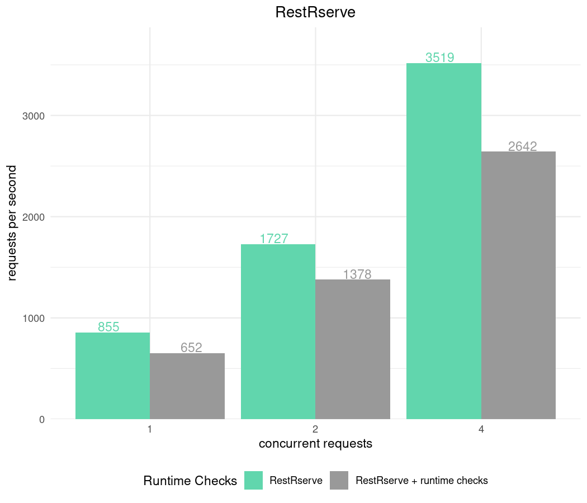

# RestRserve <a href='https://restrserve.org'></a>

<a href="https://www.rexy.ai"></a>
[](https://cran.r-project.org/package=RestRserve)
[](https://travis-ci.org/rexyai/RestRserve)
[](https://ci.appveyor.com/project/dselivanov/restrserve/branch/master)
[](https://codecov.io/gh/rexyai/RestRserve/branch/master)
[](http://www.gnu.org/licenses/gpl-2.0.html)
[](https://www.tidyverse.org/lifecycle/#maturing)
[](https://gitter.im/RestRserve/community)


[RestRserve](https://github.com/rexyai/RestRserve) is an R web API framework for building **high-performance** AND **robust** microservices and app backends. With [Rserve](https://github.com/s-u/Rserve) backend on UNIX-like systems it is **parallel by design**. It will handle incoming requests in parallel - each request in a separate fork (all the credits should go to [Simon Urbanek](https://github.com/s-u)).

## Quick start

Creating application is as simple as:
```r
library(RestRserve)
app = Application$new()

app$add_get(
  path = "/health", 
  FUN = function(.req, .res) {
    .res$set_body("OK")
  })

app$add_post(
  path = "/addone", 
  FUN = function(.req, .res) {
    result = list(x = .req$body$x + 1L)
    .res$set_content_type("application/json")
    .res$set_body(result)
  })


backend = BackendRserve$new()
backend$start(app, http_port = 8080)
```

Test it with `curl`:

```sh
curl localhost:8080/health
# OK
curl -H "Content-Type: application/json" -d '{"x":10}' localhost:8080/addone
# {"x":11}
```
### Autcomplete

Using convenient `.req`, `.res` names for handler arguments allows to leverage autocomplete.


## Learn RestRserve

- follow [quick start guide on http://restrserve.org/](https://restrserve.org/articles/RestRserve.html) for more details.
- check out "Articles" section on https://restrserve.org/
- browse [examples on https://github.com/rexyai/RestRserve](https://github.com/rexyai/RestRserve/tree/master/inst/examples)

## Features

- Stable, easy to install, small number of dependencies
- Fully featured http server with the **support for URL encoded and multipart forms**
- Build **safe and secure applications** - RestRserve supports *https*, provides building blocks for basic/token authentication
- Concise and intuitive syntax
- **Raise meaningful http errors** and allows to interrupt request handling from any place of the user code
- Well documented, comes with **many examples** - see [inst/examples](https://github.com/rexyai/RestRserve/tree/master/inst/examples)
- Saves you from boilerplate code:
  - automatically decodes request body from the common formats
  - automatically encodes response body to the common formats
  - automatically parses URI templates (such as `/get/{item_id}`)
  - helps to expose OpenAPI and Swagger/Redoc/Rapidoc UI
- It is [fast](https://restrserve.org/articles/benchmarks/Benchmarks.html)!



## Installation

### From CRAN
```r
install.packages("RestRserve", repos = "https://cloud.r-project.org")
```

### Docker

Debian and Alpine based images are available from docker-hub: [https://hub.docker.com/r/rexyai/restrserve/](https://hub.docker.com/r/rexyai/restrserve/)

```sh
docker pull rexyai/restrserve
```

Or install specific version:

```sh
docker pull rexyai/restrserve:0.4.0-minimal
```

## Contributing

Guidelines for filing issues / pull requests - [CONTRIBUTING.md](https://github.com/rexyai/RestRserve/blob/master/CONTRIBUTING.md).

## Acknowledgements

- [Simon Urbanek](https://github.com/s-u/) (@s-u) for awesome [Rserve](https://github.com/s-u/Rserve) and all the work on R itself and on his other packages
- [Jeff Allen](https://github.com/trestletech) (@trestletech) for his work on Swagger UI in [plumber](https://github.com/rstudio/plumber) (from where we took inspiration for our implementation)
- [Brodie Gaslam](https://github.com/brodieG) (@brodieG) for help with understanding on how to get traceback from try-catch function calls. Also thanks [Hadley Wickham](https://github.com/hadley) (@hadley) for `evaluate::try_capture_stack` function which we use for this purpose.

## Known limitations

- RestRserve is primarily tested on UNIX systems. While it works natively on Windows please don't expect it to be as performant as on UNIX-like systems. If you really want to use it on Windows - consider to use [Windows Subsystem for Linux](https://blog.jdblischak.com/posts/wsl-r/).
- Keep in mind that every request is handled in a separate process (fork from a parent R session). While this feature allows to handle requests in parallel it also restricts reuse of certain objects which are not fork-safe (notably database connections, rJava objects, etc)

## Related projects

- [Rook](https://github.com/jeffreyhorner/Rook)
- [FastRWeb](https://CRAN.R-project.org/package=FastRWeb)
- [opencpu](https://www.opencpu.org/)
- [plumber](https://www.rplumber.io/)
- [fiery](https://github.com/thomasp85/fiery)
- [jug](https://github.com/Bart6114/jug) (development discontinued)
